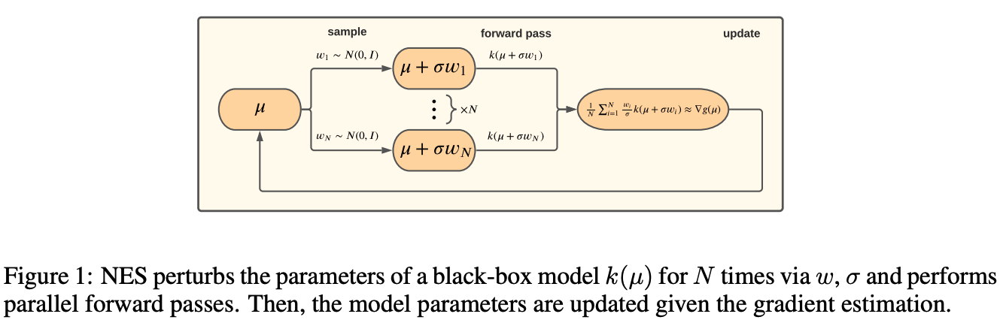

# Learning Discrete Structured Variational Auto-Encoder using Natural Evolution Strategies

This repository contains the official PyTorch implementation of [Learning Discrete Structured VAE using NES](https://openreview.net/pdf?id=JJCjv4dAbyL).

In our paper, we suggest using a black-box, gradient-free method to optimize discrete structured VAEs.
We experimentally demonstrate that it is as effective as popular gradient-based approximations although
being more general, scalable, and simpler to implement.



Specifically, the repository contains code to:
1) Optimize unstructured discrete VAE using NES (was used to demonstrate that NES can scale well with the network size)
2) Reproduce the dependency parsing experiments (`parsing` directory)

<u>Note</u>: For the <b>latent structure recovery</b> experiments we relied on
the official implementation of [Gradient Estimation with
Stochastic Softmax Tricks](https://github.com/choidami/sst).

## Installation
First, install Python 3.7. \
Then, clone this repository and install the dependencies (preferably using a conda environment):
```
git clone https://github.com/BerlinerA/DSVAE-NES
cd DSVAE-NES
pip install -r requirements.txt
```
For running the dependency parsing experiments, you should also manually install the following packages:
* [ad3](https://github.com/andre-martins/ad3)
* [sparsemap](https://github.com/vene/sparsemap)

Before running the code, configure the GPUs that NES will run on using the <b>CUDA_VISIBLE_DEVICES</b> environment variable:
```
export CUDA_VISIBLE_DEVICES=0,1,2
```

## Unstructured discrete VAE
Optimize the unstructured VAE on one of the four supported benchmarks.

<u>For optimization using <b>NES</b>, run:</u>
```
python train.py --dataset [MNIST, FashionMNIST, KMNIST or Omniglot] --binarize --validate --nes --n_perturb [number of samples]
```

<u>For optimization using <b>SST</b>, run:</u>
```
python train.py --dataset [MNIST, FashionMNIST, KMNIST or Omniglot] --binarize --validate --sst
```

## Dependency parsing

### Data 
The experiments were performed on datasets from the [Universal Dependencies](https://universaldependencies.org/).
The datasets should be organized as follows:
```bash
datasets_dir
├── dataset1_name
│     ├── train.conllu
│     ├── dev.conllu
│     └── test.conllu
└── dataset2_name
      ├── train.conllu
      ├── dev.conllu
      └── test.conllu
```

### Running experiments
In order to run unsupervised domain adaptation experiments,
begin with training the model on the source domain in a supervised manner by running:
```
python train.py --source [source domain name] --target [target domain name] --ext_emb [external word vectors file]
--target_epochs 0
```
You may include the `--non_projective` flag for non-projective dependency parsing.

Next, train the structured VAE on the target domain in an unsupervised manner.

<u>For optimization using <b>NES</b>, run:</u>
```
python train.py --source [source domain name] --target [target domain name] --ext_emb [external word vectors path]
--source_epochs 0 --pretrained_path [pretrained model weights directory] --nes --freeze_decoder
```
Again, you may include the `--non_projective` flag for non-projective dependency parsing.

<u>For optimization using <b>DPP</b>, run:</u>
```
python train.py --source [source domain name] --target [target domain name] --ext_emb [external word vectors path]
--source_epochs 0 --pretrained_path [pretrained model weights directory]
```

<u>For optimization using <b>sparseMAP</b>, run:</u>
```
python train.py --source [source domain name] --target [target domain name] --ext_emb [external word vectors path]
--source_epochs 0 --pretrained_path [pretrained model weights directory] --non_projective
```

For all methods, tune the `--target_lr` parameter over the [5e-4, 1e-5] interval.

## Cite
If you make use of this code for your research, we'll appreciate citing our paper:
```
@inproceedings{berliner2021learning,
  title={Learning Discrete Structured Variational Auto-Encoder using Natural Evolution Strategies},
  author={Berliner, Alon and Rotman, Guy and Adi, Yossi and Reichart, Roi and Hazan, Tamir},
  booktitle={International Conference on Learning Representations},
  year={2021}
}
```

